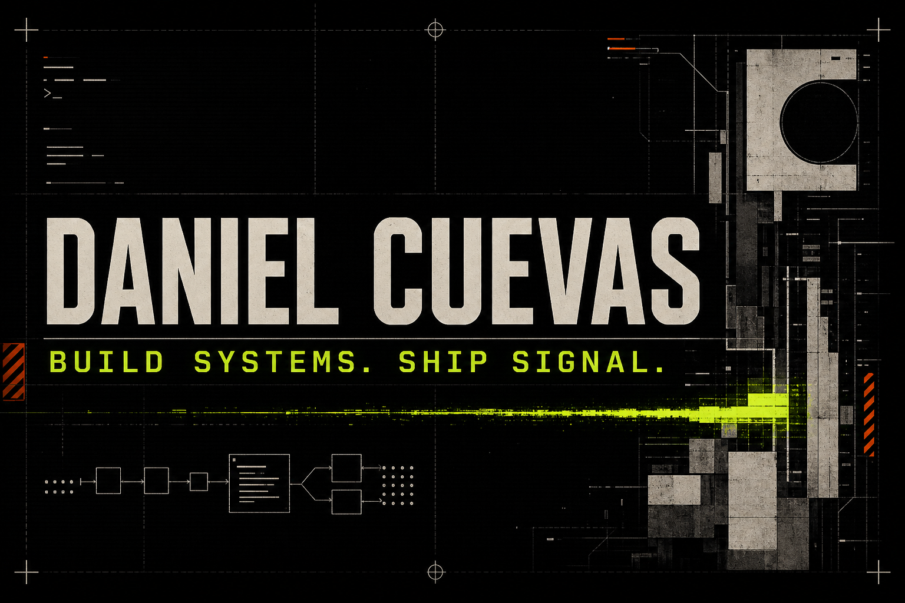

  <strong>SOFTWARE WITH A SPINE.</strong>

  I build compact systems that turn messy inputs into clear, useful evidence.

  <code>TypeScript</code>
  <code>Data systems</code>
  <code>Accessibility</code>
  <code>Developer tools</code>

## Current signal

| Project | What it proves |
| --- | --- |
| [GTFS Accessibility Auditor](https://github.com/DanielCuevas1208/gtfs-accessibility-auditor) | Streaming data ingestion, explainable scoring, and actionable transit reports |
| [Web Accessibility Regression Guard](https://github.com/DanielCuevas1208/web-a11y-regression-guard) | Baseline diffing, Playwright integration, and focused CI annotations |

Both projects include deterministic tests, continuous integration, sample data, and direct setup instructions.

## How I build

- Make the problem visible.
- Keep the core behavior testable.
- Prefer evidence over confident output.
- Treat accessibility as an engineering constraint.
- Ship a complete small system before a large promise.

## Explore the work

Visit [danielcuevas1208.github.io](https://danielcuevas1208.github.io) for project details and architecture notes.

  <a href="https://danielcuevas1208.github.io">PORTFOLIO</a>
  &nbsp;/&nbsp;
  <a href="https://github.com/DanielCuevas1208?tab=repositories">REPOSITORIES</a>

